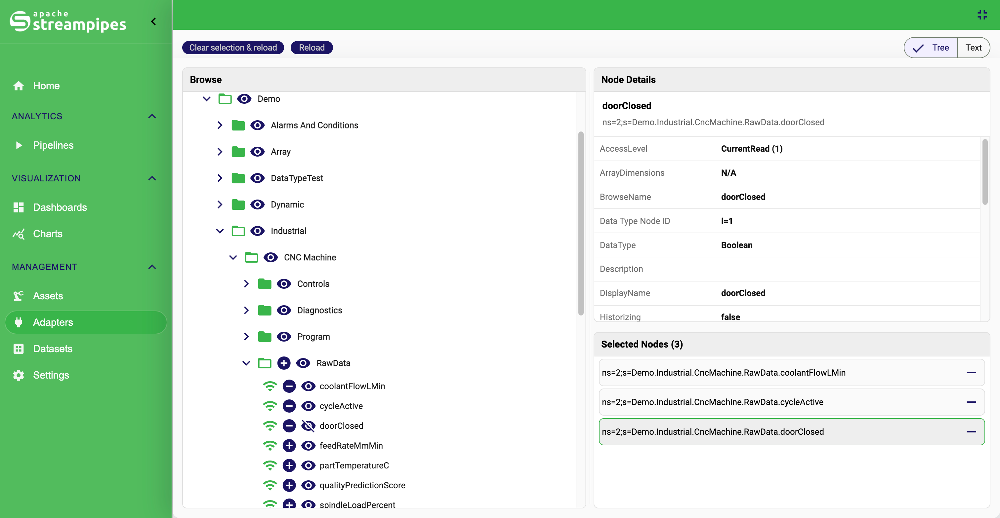
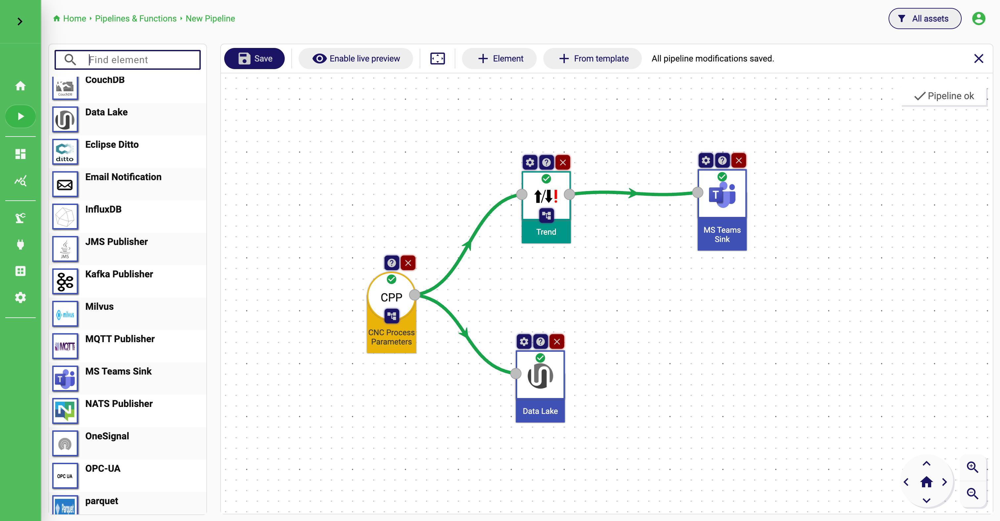
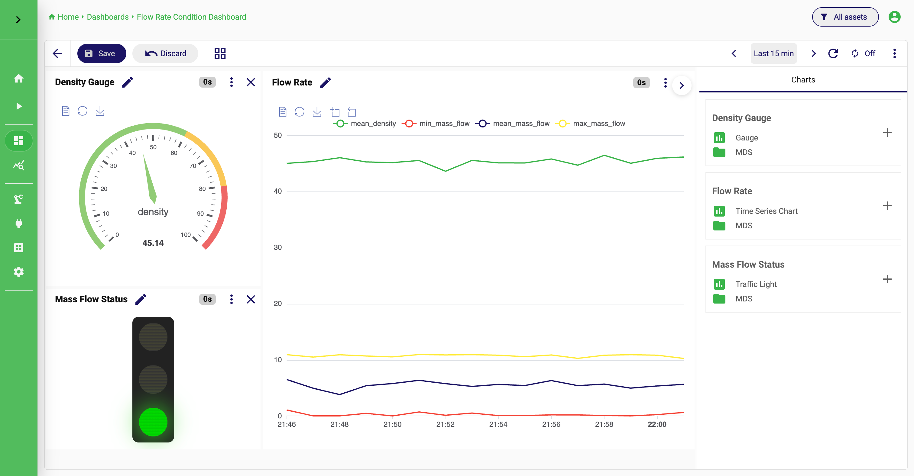
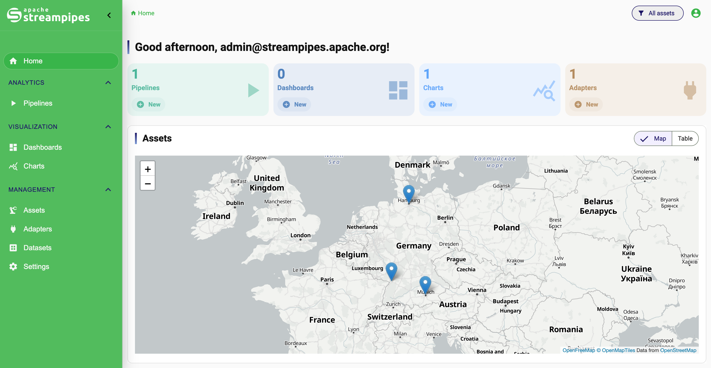
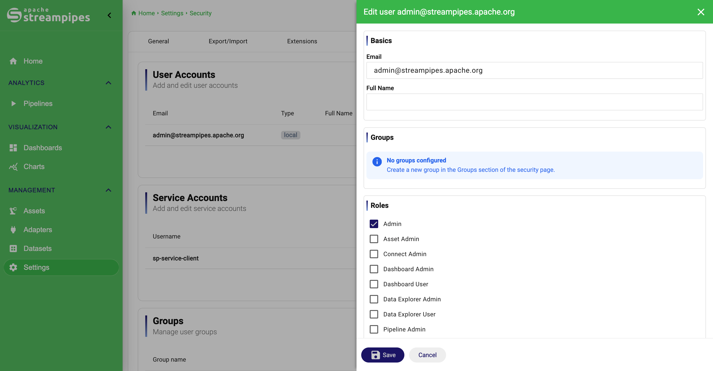

<!--
  ~ Licensed to the Apache Software Foundation (ASF) under one or more
  ~ contributor license agreements.  See the NOTICE file distributed with
  ~ this work for additional information regarding copyright ownership.
  ~ The ASF licenses this file to You under the Apache License, Version 2.0
  ~ (the "License"); you may not use this file except in compliance with
  ~ the License.  You may obtain a copy of the License at
  ~
  ~    http://www.apache.org/licenses/LICENSE-2.0
  ~
  ~ Unless required by applicable law or agreed to in writing, software
  ~ distributed under the License is distributed on an "AS IS" BASIS,
  ~ WITHOUT WARRANTIES OR CONDITIONS OF ANY KIND, either express or implied.
  ~ See the License for the specific language governing permissions and
  ~ limitations under the License.
  ~
  -->

[](https://github.com/apache/streampipes/actions/)
[](https://hub.docker.com/r/apachestreampipes/backend/)

[](https://img.shields.io/maven-central/v/org.apache.streampipes/streampipes-service-core.svg)
[](http://www.apache.org/licenses/LICENSE-2.0)
[]()
[](https://dashboard.cypress.io/projects/q1jdu2/runs)
[](https://github.com/apache/streampipes/graphs/contributors)

[](https://github.com/apache/streampipes/issues?q=is%3Aissue+is%3Aopen+label%3A%22good+first+issue%22)
[](https://streampipes.apache.org)
<br>
[](https://linkedin.com/company/apache-streampipes)
[](https://x.com/StreamPipes)

<h1 align="center">
  
</h1>

<h3 align="center">Open Source Industrial IoT Data Platform</h3>

<p align="center">
  Apache StreamPipes helps teams connect industrial data sources, build real-time streaming pipelines, explore time-series data, and deliver live operational insights without requiring many different systems or custom code for every use case.
</p>

## Overview

Apache StreamPipes is an end-to-end industrial IoT data platform that combines a graphical user interface for domain experts with an extensible framework for developers. It enables teams to connect industrial data sources, process real-time data streams, store historical data, and build data-driven applications on top of industrial equipment.

StreamPipes provides an opinionated architecture for managing industrial IoT data. Most users rely on StreamPipes to make data from machines, production systems, and other industrial assets available to analytics, monitoring, and application layers.

A standard StreamPipes installation includes everything needed to get started: a messaging system for real-time data exchange, with NATS as the default and support for additional protocols, as well as a time-series database for storing historical data. StreamPipes also includes a wide range of connectors tailored to industrial IoT requirements. For example, it provides extensive OPC UA support, including a web-based node browser and support for OPC UA events.

StreamPipes is fully open source, governed by the Apache Software Foundation, and includes enterprise-grade capabilities such as user and role management, OAuth 2.0 integration, and support for geographically distributed deployments that simplify communication between OT and IT networks.

As a ready-to-use platform, StreamPipes enables users to implement industrial IoT use cases on top of a reliable data foundation. Developers can extend the platform through REST APIs, client libraries for various programming languages, and an SDK for building custom connectors, processors, sinks, and application logic.

## Product Tour

| Feature                                        | Preview                                                            |
|------------------------------------------------|--------------------------------------------------------------------|
| Connect data sources with a guided setup flow  |     |
| Build stream analytics pipelines visually      |  |
| Create beautiful charts and dashboards         |               |
| Asset-centric organization and navigation      |                            |
| Administration, users, and platform operations |      |


### Built for users

- Connect industrial and messaging systems such as OPC UA, PLCs, MQTT, REST, Pulsar, Kafka, and more.
- Build harmonization and analytics pipelines with a library of ready-to-use adapters, processors, and sinks.
- Explore historical data visually with charts tailored to time-series use cases.
- Create live dashboards for real-time monitoring on the shop floor or in operations centers.
- Organize pipelines, streams, and dashboards around assets and operational structures.

### Built for developers

- Extend the platform with custom adapters, processors, and sinks through the Java SDK.
- Run pipeline elements as standalone microservices in central or edge deployments.
- Integrate existing processing logic and ML models into reusable pipeline elements.
- Use our Python, Go or Java client to interact with StreamPipes from your own applications.

## Quick Start

### Run StreamPipes as a user

The fastest way to get a full installation with extensions is to use one of the Docker-based installers:

- [StreamPipes Compose](installer/compose) for container-based deployment
- [StreamPipes CLI](installer/cli) for developers who want to extend StreamPipes (**deprecated**)
- [StreamPipes k8s](installer/k8s) for cluster-based operation

For most first-time users, `installer/compose` is the right starting point.

```bash
cd installer/compose
docker-compose up -d
```

After the services are up, open `http://localhost` to complete the setup in the browser.

### Build StreamPipes as a developer

> **Deprecated:** The StreamPipes CLI remains available for existing users, but it is deprecated and will be removed in a future release. For local development, prefer the dev container setup described below.

#### Dev Container Setup (Experimental)

The repository includes an experimental dev container setup in [`.devcontainer`](.devcontainer). It starts the required third-party services with Docker Compose and provides a containerized development environment for running StreamPipes from source.

For users not using VS Code, the dev container files can still serve as the reference setup for the required development services and environment variables. See [`.devcontainer/docker-compose.yml`](.devcontainer/docker-compose.yml), [`.devcontainer/.env.example`](.devcontainer/.env.example), and [`.devcontainer/README.md`](.devcontainer/README.md) for the current Compose configuration.

For VS Code users, open the repository in VS Code and run `Dev Containers: Reopen in Container`. After the container has started, use the included VS Code tasks or debug launch configurations to start the core, extensions, and UI.

Prerequisites:

- Java 25 JDK
- Maven 3.8+
- Node.js and npm for the UI build
- Docker and Docker Compose

Backend build:

```bash
mvn clean package
```

UI build:

```bash
cd ui
npm install
npm run build
```

From the repository root, you can start the full stack with:

```bash
docker-compose up --build -d
```

This will start a development stack with no volumes! Choose the installation options from the `installer` page for production setups.

For backend changes, prefer targeted module validation first, for example:

```bash
mvn -pl <module> -am test
```

## Documentation

The main documentation lives at [streampipes.apache.org/docs](https://streampipes.apache.org/docs/user-guide-introduction).

- [Quick start guide](https://streampipes.apache.org/docs/quick-start-guide)
- [Create adapters](https://streampipes.apache.org/docs/use-connect)
- [Build pipelines](https://streampipes.apache.org/docs/use-pipelines)
- [Developer setup](https://streampipes.apache.org/docs/extend-setup)
- [Write custom pipeline elements](https://streampipes.apache.org/docs/extend-archetypes.html)

## Repository Structure

This repository contains the StreamPipes platform, SDKs, extensions, installers, and UI in a single monorepo. A few important entry points:

- [`streampipes-service-core`](streampipes-service-core) for bootstrapping, security, migrations, and scheduling
- [`streampipes-rest`](streampipes-rest) for HTTP and resource APIs
- [`streampipes-extensions`](streampipes-extensions) for bundled adapters and pipeline elements
- [`streampipes-sdk`](streampipes-sdk) for extension development
- [`ui`](ui) for the web application
- [`installer`](installer) for Compose, deprecated CLI, and Kubernetes deployment options

## Extending StreamPipes

StreamPipes is designed to be extended. Custom processors, sinks, and data sources can be packaged as pipeline elements and deployed independently of the core platform.

- Use the [Java SDK](https://streampipes.apache.org/docs/how-to-custom-data-processor) to wrap existing processing logic.
- Package new functionality as containerized microservices.
- Deploy extensions centrally or near the edge, depending on latency and infrastructure constraints.

The bundled extension code lives in [`streampipes-extensions`](https://github.com/apache/streampipes/tree/dev/streampipes-extensions).

## Community

### Get help

- [Support channels](https://streampipes.apache.org/docs/community-get-help/)
- [Mailing lists](https://streampipes.apache.org/community/mailing-lists/)
- [Quick start guide](https://streampipes.apache.org/docs/quick-start-guide)

Or simply use Github Discussions.

To subscribe directly to a mailing list:

- [users-subscribe@streampipes.apache.org](mailto:users-subscribe@streampipes.apache.org)
- [dev-subscribe@streampipes.apache.org](mailto:dev-subscribe@streampipes.apache.org)

### Contribute

Contributions are welcome across core services, UI, extensions, installers, and documentation.

- Review [CONTRIBUTING.md](CONTRIBUTING.md)
- Check the [Get Involved](https://streampipes.apache.org/community/get-involved/) page
- Browse [open issues](https://github.com/apache/streampipes/issues)
- Start with a [good first issue](https://github.com/apache/streampipes/issues?q=is%3Aissue+is%3Aopen+label%3A%22good+first+issue%22)
- Visit the [developer wiki](https://cwiki.apache.org/confluence/display/STREAMPIPES)

### Report bugs or request features

- [Bug reports](https://github.com/apache/streampipes/issues)
- [Feature ideas and discussions](https://github.com/apache/streampipes/discussions/categories/ideas)

## License

[Apache License 2.0](LICENSE)
