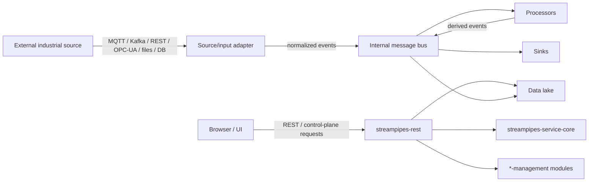

<!--
  Licensed to the Apache Software Foundation (ASF) under one or more
  contributor license agreements.  See the NOTICE file distributed with
  this work for additional information regarding copyright ownership.
  The ASF licenses this file to you under the Apache License, Version 2.0
  (the "License"); you may not use this file except in compliance with
  the License.  You may obtain a copy of the License at

    http://www.apache.org/licenses/LICENSE-2.0

  Unless required by applicable law or agreed to in writing, software
  distributed under the License is distributed on an "AS IS" BASIS,
  WITHOUT WARRANTIES OR CONDITIONS OF ANY KIND, either express or implied.
  See the License for the specific language governing permissions and
  limitations under the License.
-->

# Apache StreamPipes — Threat Model

## §1 — Purpose and consumers

This document describes the **implicit security contract** between Apache
StreamPipes and its downstream operators: what StreamPipes assumes about its
environment, what it upholds, what it leaves to the operator, and which
"syntactically possible" misuses fall outside the intended design. It serves
integrators/operators (which threats they own) and triagers (classifying a
scanner/AI/CVE-style finding as valid, out of model, or disclaimed by design —
cite the relevant section).

## §2 — What StreamPipes is

Apache StreamPipes is an **open-source Industrial IoT data platform** for
connecting industrial data sources, building real-time streaming pipelines, and
exploring time-series data. In-scope component families, based on architecture
boundaries in the root `AGENTS.md`, are:

| Component | Role | Primary surface |
| --- | --- | --- |
| **`streampipes-rest`** | The primary HTTP/REST control-plane boundary: authentication, user/resource management, pipeline control, adapter control, and data-lake queries. The UI drives configuration through this control plane. It is not the external data-ingress path. | network control boundary |
| **`streampipes-service-core`** | Bootstrapping, security, migrations, scheduling. | in-process |
| **`*-management` modules** | Business/domain logic for pipelines, adapters, data lake, and related resources. | in-process |
| **Connect source/input adapters (extensions)** | The external data-ingress path. Adapters connect to external sources (MQTT, Kafka, REST, OPC-UA, HTTP, files, databases, etc.), ingest raw data, normalize it into events, and publish those events onto the internal bus for downstream processing. | external-data ingestion boundary |
| **Pipeline elements (processors/sinks)** | Processing and sink logic over event streams carried by the internal bus; deployable as extensions. | in-process / extension-runtime code |
| **Internal message bus** | Internal event transport carrying adapter-normalized and processor-derived events between processing steps. External data enters through source/input adapters; the bus is not directly writable from outside the assumed deployment perimeter. | intra-deployment infrastructure |
| **Data lake** | Time-series persistence and queryable event history. | intra-deployment infrastructure |
| **UI** (`ui/`) | Browser client that drives configuration and visualization through the control plane. | client trust domain |

StreamPipes is **not** a single hardened process. It is a multi-service
deployment that depends on an internal message broker, a time-series/metadata
store, extension-runtime services, and the external data sources its adapters
connect to. Broker and datastore components are modeled as trusted dependencies
inside an operator-controlled, network-isolated perimeter.

## §2.1 — Assets protected by this model

| Asset | Why it matters | Primary owner |
| --- | --- | --- |
| Admin accounts and privileged roles | Control over users, adapters, pipelines, and deployment-level configuration. | StreamPipes + operator |
| User accounts, sessions, and access tokens | Access to control-plane APIs and permitted resources. | StreamPipes |
| Initial admin password and client secret | Bootstrap credentials that can become global compromise if left at known defaults. | operator + StreamPipes defaults |
| Adapter/source credentials | Access to industrial systems, databases, message brokers, and external APIs. | operator, protected by StreamPipes handling |
| Pipeline definitions and adapter configurations | Determine what data is ingested, transformed, stored, and sent to sinks. | StreamPipes + operator |
| Event and time-series data | May contain sensitive industrial telemetry or operational information. | operator, protected by StreamPipes access control |
| Internal broker topics/messages | Internal transport for normalized and derived events. | operator infrastructure |
| Extension artifacts and custom code | Execute in extension-runtime containers and may reach broker/datastore services. | operator |
| Logs and error reports | Useful for debugging but must not expose credentials or sensitive payloads unnecessarily. | StreamPipes + operator |

## §3 — Adversaries in and out of scope

**In scope**

1. An **authenticated-but-limited UI/REST user** trying to act outside their
   role/permissions, such as reading other users' pipelines, modifying resources
   they do not own, escalating privileges, or reaching host-level capabilities.
   "Limited" is graduated: StreamPipes has a fine-grained role model
   (`ROLE_PIPELINE_USER`, `ROLE_CONNECT_ADMIN`, `ROLE_DASHBOARD_USER`, etc.), not
   only an admin/user split.
2. A **network adversary** between the browser/clients and the REST layer, or
   between services, where transport security is not configured.
3. A **compromised or faulty operator-trusted source** feeding malformed,
   oversized, schema-mismatched, or hostile *content* into an adapter ingestion
   path. Sources are operator-provisioned, so this is a hostile-content
   adversary, not an attacker who can introduce a new source. The robustness
   StreamPipes-owned code guarantees against such content is defined in §5, §7,
   and §10.

**Out of scope**

4. **An operator with host, container, broker, or datastore access.** Anyone
   controlling the deployment infrastructure is not an adversary StreamPipes
   defends against → `OUT-OF-MODEL: adversary-not-in-scope`.
5. **A trusted admin performing an authorized action**, such as installing an
   extension, registering an adapter, changing configuration, or provisioning a
   source. A new path to a privilege already held is
   `OUT-OF-MODEL: equivalent-harm`.
6. **Bugs in infrastructure StreamPipes orchestrates or depends on** — the
   broker, datastore, JVM, or an upstream OPC-UA/MQTT/Kafka library. Report
   upstream unless StreamPipes-owned code reaches the vulnerable path with
   attacker-influenceable input → `OUT-OF-MODEL: unsupported-component`.

## §4 — Trust boundaries and data flow

StreamPipes has one primary control-plane boundary and one external data-ingress
path. The internal bus sits behind the ingress path and is not directly
attacker-writable under the assumed deployment architecture.

- **Client (UI/API) → StreamPipes control plane** is the control boundary.
  Requests are authenticated and authorized on two tiers — a role/privilege gate
  plus a per-object ACL — before acting. Request bodies, pipeline definitions,
  adapter definitions, and configuration crossing this boundary are treated as
  untrusted and authorized per resource.

- **External source → source/input adapter** is the external data-ingress path.
  Adapters connect to external systems, ingest raw data, normalize it into
  events, and publish those events internally. **Source provisioning is
  operator/admin-only**; no in-scope lower-privileged adversary can introduce a
  source. Data from configured sources remains untrusted content for
  StreamPipes-owned parsers and transformations, but the semantic trustworthiness
  of that data remains an operator/source concern.

- **Internal bus + inter-service transport** run inside an operator-controlled,
  network-isolated perimeter. Downstream processors may publish derived events
  internally, but the bus is not directly writable from outside the assumed
  deployment perimeter.

## §5 — What StreamPipes upholds (given §3/§4 assumptions)

- **Authentication** of UI/REST access before privileged actions. Authentication
  is stateless and token-based (`TokenAuthenticationFilter`,
  `SessionCreationPolicy.STATELESS`); form login and HTTP Basic are disabled;
  OAuth2 login is optional. The default rule is `anyRequest().authenticated()`.
  The only unauthenticated endpoints are a narrow, non-sensitive asset allowlist
  for pipeline-element/adapter assets; no control or data endpoint is intended
  to be unauthenticated by default.

- **Authorization** is two-tier and per-resource: a role/privilege gate
  (`@PreAuthorize`) plus per-object ACL checks (`SpPermissionEvaluator`,
  `@PostFilter` for list results). Non-admins are bounded to owned/permitted
  resources; admins bypass the object ACL by design (§3 item 5). Precedence is:
  anonymous-if-permitted → admin → per-object ACL.

- **Parser and transformation safety for built-in ingestion paths.** Malformed
  syntax or schema-mismatched input in built-in parsers is expected to fail the
  affected event or adapter operation without compromising unrelated StreamPipes
  resources. StreamPipes-owned parsing, schema-based transformation,
  datatype/timestamp coercion, and event handling must not cause code execution,
  secret disclosure, authorization bypass, corruption of unrelated resources, or
  uncontrolled cross-adapter impact when reached by hostile external content.
  This does not guarantee semantic correctness of source data, bounded cost for
  every oversized payload shape, or robustness of custom extension parsers.
  Resource bounding is covered separately in §7 and §10.

- **Memory safety on well-formed input** to the JVM's extent. StreamPipes is
  primarily Java; this is not a guarantee against all denial-of-service or
  resource-exhaustion cases.

## §6 — What StreamPipes leaves to the operator

- **Transport security (TLS)** on the REST endpoint, broker, datastore, and
  inter-service transport, plus the security of those backing services.
  StreamPipes makes no blanket wire-encryption guarantee by itself (§8).
- **Network isolation** of the broker, datastore, and extension-runtime services
  from untrusted networks (§3 item 4, §4).
- **Vetting installed adapters and pipeline elements.** Installing a JAR
  extension is deploying code into the runtime — code execution by design, not a
  sandbox against the extension author (§7).
- **Securing external data sources** and credentials configured for them. The
  ingestion path has StreamPipes-owned parser/transformation safety expectations
  (§5), but the trustworthiness, units, sensor correctness, and business meaning
  of source data remain operator concerns (§7).
- **Setting initial-admin and client-secret credentials** and hardening the
  deployment beyond insecure convenience defaults (§8). Reports against exposed
  shipped defaults are handled according to §9, not automatically dismissed.

## §7 — Properties StreamPipes does *not* uphold (by design)

- **A sandbox around installed JAR extensions.** Adapters/processors/sinks are
  deployed as separate container services (for example, `connect-adapters`),
  which provides process/namespace isolation from the core and defense-in-depth
  against a limited REST/UI user who cannot supply container code. This is **not**
  a boundary against whoever builds and installs the extension: that code runs
  inside the container with its privileges. The shipped compose applies no
  `cap_drop`/`security_opt`/non-root `user`/`read_only` hardening and leaves the
  broker/datastore reachable on the shared `spnet`. Installing an extension is
  trusting that code. `BY-DESIGN: property-disclaimed`. Container hardening beyond
  the default is an operator concern (§8).

- **Note — user-supplied JS transform scripts are sandboxed.** Unlike installed
  JARs, the GraalJS transformer (`GraalJsScriptEngine`) runs user scripts under
  `SandboxPolicy.CONSTRAINED` + `HostAccess.CONSTRAINED`, with
  `allowHostClassLookup` disabled and host access limited to `@ExposedToScripts`
  members. This is a containment boundary: arbitrary host-code execution from a
  script is not intended, and a break of this sandbox is in-model and VALID.

- **Protection against an operator who controls the deployment infrastructure**
  (§3 item 4).

- **Semantic trust in external source data.** StreamPipes does not guarantee that
  data from an external industrial source is truthful, physically plausible,
  correctly timestamped, correctly typed, or safe for downstream operational
  decisions. Source trust, units, sensor correctness, and business meaning are
  operator concerns. This is distinct from parser/transformation safety (§5):
  hostile content must not compromise StreamPipes-owned code, even though its
  meaning is not vouched for.

- **Absolute resource fairness across all inputs and pipeline logic.** A
  byte-based, memory-coupled rate limiter (`SpRateLimiter`, default-on at
  extension-service startup) throttles sustained ingress: each event costs
  permits equal to its byte size, the permit budget is a percentage of JVM total
  memory, and overload applies backpressure (`tryAcquire` with timeout). This is
  intended to bound sustained high-rate/high-volume sources after metering. It
  does **not** guarantee bounded processing for every single malformed or
  oversized input, nor does it bound compute complexity inside an individual
  pipeline element. For StreamPipes-owned built-in paths, single-event parsing or
  processing exhaustion may be in-model (§10). For custom elements, pathological
  compute or memory behavior is unvetted extension logic and an operator concern.

## §8 — Key configuration levers (load-bearing)

| Lever | Real name / default | Why it matters |
| --- | --- | --- |
| Initial-admin / auth setup | `SP_INITIAL_ADMIN_EMAIL` (default `admin@streampipes.apache.org`), `SP_INITIAL_ADMIN_PASSWORD` (**default `admin`**), `SP_INITIAL_CLIENT_SECRET` (**default `my-apache-streampipes-secret-key-change-me`**). On first start, if the user DB does not exist, `AutoInstallation` provisions the admin from these env vars, falling back to defaults when unset. | Determines whether a fresh instance starts with known bootstrap credentials. Operators must replace these values for production. If StreamPipes allows production-reachable startup with known defaults and no prominent warning or forced rotation, that is a hardening gap rather than automatically `OUT-OF-MODEL`. |
| Role / permission model | Two-tier: `@PreAuthorize` privilege + per-object ACL (`SpPermissionEvaluator`). Fine-grained roles (`ROLE_CONNECT_ADMIN`, `ROLE_PIPELINE_USER`, etc.). | Bounds non-admins to owned/permitted resources and determines which roles may configure adapters/pipelines. |
| Auth on endpoints | `anyRequest().authenticated()`; unauthenticated allowlist = pipeline-element/adapter asset paths only. | No control/data endpoint is intended to be unauthenticated by default. |
| Rate limiter | `SpRateLimiter`, default-on; permit budget = percentage of JVM memory, plus warmup and acquire-timeout env vars. | Bounds sustained ingress rate/volume after metering and applies backpressure. It is not a complete guarantee against single-event parsing exhaustion. |
| Extension container hardening | Shipped compose: no `cap_drop`/`security_opt`/non-root `user`/`read_only`; extension services on shared `spnet`. | Container isolation exists, but default hardening is minimal. |
| TLS on REST + broker + datastore | Operator-configured. | Determines whether sessions/events are protected on the wire. |

## §9 — Known non-findings and triage notes

- **"A custom adapter / processor JAR can run arbitrary code."** By design —
  installing a JAR extension is an authorized code deployment, not a sandbox
  escape. `BY-DESIGN`.

- **"The JS transformer runs user script, therefore RCE."** Not by itself. The
  GraalJS engine runs scripts under a constrained sandbox with host-class lookup
  disabled and host access limited to `@ExposedToScripts`. In-model and VALID
  only if the report demonstrates breaking that sandbox, escaping the constrained
  policy, or abusing an exposed host surface in a way that violates the intended
  containment boundary.

- **"An adapter can be pointed at an internal URL (SSRF)."** Configuring an
  adapter target requires the `WRITE_ADAPTER` privilege, held by
  `ROLE_CONNECT_ADMIN`, not a plain user. A Connect Admin choosing where to
  connect is an authorized action (§3 item 5) →
  `OUT-OF-MODEL: equivalent-harm`. In-model and VALID only if a lower-privileged
  role can set the target, or if an authorization bypass lets a user modify
  another user's adapter configuration.

- **"CSRF protection is disabled."** Not automatically a finding for the default
  stateless token-auth model. A CSRF report is in-model only if StreamPipes
  itself stores or sends authentication material in a browser-ambient way, such
  as a cookie-bearing session, or if a shipped default creates such a condition.
  An operator-created cookie/session wrapper is `OUT-OF-MODEL: non-default-build`.

- **"An unauthenticated endpoint is reachable."** In-model only if it is outside
  the shipped non-sensitive asset allowlist (`/sec|sepa|stream/*/assets/**`,
  `/api/v1/worker/adapters/*/assets/**`) or if the endpoint exposes control,
  data, credentials, secrets, or sensitive metadata. An operator-loosened auth
  config is `OUT-OF-MODEL: non-default-build`.

- **"The instance is reachable with admin/admin or the default client secret."**
  A production-reachable fresh installation that accepts shipped bootstrap
  credentials is **security-relevant** and should not be automatically routed to
  `OUT-OF-MODEL: non-default-build`. It may be treated as operator
  misconfiguration only when production installation clearly requires overriding
  those values and StreamPipes prominently warns, blocks startup, generates
  instance-unique values, or forces rotation before use. If those safeguards are
  absent or weak, triage as a hardening gap or valid shipped-default issue.

- **"A high-rate source OOM-crashes the extension service."** A report based
  only on sustained high event rate is not sufficient if the default limiter
  properly applies backpressure. A report is in-model if it shows that the
  limiter is bypassed, disabled by default, ineffective on a built-in path, or
  unable to prevent single-event parsing exhaustion.

- **"A pathological pipeline element hangs or uses super-linear CPU."** The rate
  limiter bounds sustained ingress bytes after metering, not arbitrary per-element
  compute. For a built-in element, this may be a bug. For a custom element, it is
  unvetted extension logic and an operator concern (§7).

- **Dependency-tail CVEs** from an SCA scanner, such as in a Kafka/MQTT/OPC-UA
  client or transitive JAR, are triaged upstream unless StreamPipes-owned code
  reaches the vulnerable path with attacker-influenceable input. A raw
  CVE-in-a-JAR report with no reachable path is not by itself a StreamPipes
  finding.

## §10 — Triage dispositions

Route every finding to **exactly one** disposition below and cite the justifying
section named in parentheses.

A finding is **VALID** only when all of the following hold: the violated
property is one StreamPipes claims (§5), the attacker is in scope (§3), and the
affected code is on an in-model surface (§2/§4) reached by untrusted input.

Otherwise route to exactly one of:

- `OUT-OF-MODEL: adversary-not-in-scope` — the attacker is excluded by §3.
- `OUT-OF-MODEL: equivalent-harm` — the attacker already holds equivalent
  capability, so the property is not one StreamPipes upholds (§7).
- `OUT-OF-MODEL: unsupported-component` — the affected surface is not a modeled
  component (§2); e.g. broker, data lake, JVM, or other perimeter-internal
  infrastructure without a StreamPipes-owned reachable path.
- `OUT-OF-MODEL: non-default-build` — the issue depends on an operator-created
  or non-default configuration outside the shipped security model; e.g.
  operator-disabled TLS, loosened auth rules, an operator-created cookie session,
  exposed broker/datastore ports, or an unvetted installed extension.
- `BY-DESIGN: property-disclaimed` — the property is one StreamPipes explicitly
  does not uphold (§7); e.g. installed JAR extension code execution.

Do not classify shipped-default bootstrap credentials as `non-default-build`
merely because the operator failed to override them. Use §9's default-credential
triage note.

### Ingestion-boundary examples

**VALID examples**

- A malformed JSON, XML, CSV, Avro, or timestamp payload crashes the adapter
  service or causes an uncontrolled restart loop in StreamPipes-owned code.
- A hostile timestamp string causes the adapter to stop emitting all events
  instead of failing only the affected event or adapter operation.
- A single oversized document exhausts memory/CPU during parsing, before the rate
  limiter meters it, in StreamPipes-owned code.
- A malformed adapter payload causes credentials, tokens, connection strings, or
  secrets to be logged or returned via API.
- A non-admin user can modify schema mappings, timestamp conversion, adapter
  targets, or adapter configuration outside their permissions.
- Hostile input reaches a StreamPipes-owned parser or transformation path and
  triggers code execution, deserialization abuse, unauthorized file/network
  access, or corruption of unrelated resources.
- A built-in pipeline element has super-linear behavior reachable from hostile
  source content and can be used to exhaust CPU or memory across unrelated
  resources.

**Normally OUT-OF-MODEL / data-quality examples**

- A sensor sends a false but well-formed temperature value.
- A source sends a timestamp with the wrong timezone, and StreamPipes processes
  it according to the configured parser.
- An operator maps the wrong schema attribute to the timestamp field.
- An admin intentionally installs a custom adapter, processor, script, or
  extension that changes event semantics.
- An operator exposes the broker, datastore, or extension runtime to an untrusted
  network contrary to deployment assumptions.
- A sustained high-rate source is throttled by `SpRateLimiter` rather than
  crashing the service.

## §11 — Seed threats

The following seed threats are not an exhaustive vulnerability list. They are
starting points for future review, regression tests, and triage.

| ID | Category | Surface | Threat | In-scope when | Primary mitigation / expectation | Status |
| --- | --- | --- | --- | --- | --- | --- |
| T1 | Spoofing / Elevation of privilege | REST control plane | User acts as another user or escalates role. | Limited UI/REST user can bypass authn/authz. | Token auth, role gates, per-object ACL. | Modeled |
| T2 | Tampering | Pipeline/adapter resources | User modifies another user's pipeline, adapter, schema mapping, or timestamp conversion. | Per-object ACL or privilege check can be bypassed. | `@PreAuthorize`, `SpPermissionEvaluator`, `@PostFilter`. | Modeled |
| T3 | Information disclosure | Adapter/source configuration | Source credentials or client secrets are exposed via API, UI, logs, or error messages. | Reached by lower-privileged user or hostile input. | Secret redaction, ACL, safe error handling. | Modeled |
| T4 | Denial of service | Built-in ingestion path | Malformed or oversized input crashes an adapter or causes uncontrolled restart/resource exhaustion. | Occurs in StreamPipes-owned parser/transformation/event-handling code. | Per-event failure, bounded parsing, rate limiting, safe errors. | Modeled |
| T5 | Elevation of privilege | JS transformer | User script escapes GraalJS sandbox into host-code execution. | Script breaks intended constrained sandbox or exposed host surface. | Graal sandbox policy and narrow host exposure. | Modeled |
| T6 | Elevation of privilege / SSRF-shaped authz issue | Adapter target configuration | Lower-privileged user points adapter at internal URL or modifies another user's target. | User lacks `WRITE_ADAPTER` or target resource permission. | Role gate and object ACL. | Modeled |
| T7 | Information disclosure / Tampering | Internal bus/datastore | External actor reads/writes broker topics or datastore. | Only if exposed by shipped defaults or StreamPipes config; otherwise operator infra issue. | Network isolation, broker/datastore auth/TLS. | Operator/shared |
| T8 | Spoofing / Elevation of privilege | Bootstrap credentials | Fresh production-reachable instance accepts known shipped defaults. | Defaults usable without forced rotation, generated secret, block, or prominent warning. | Require override, generate unique secret, warn/block/rotate. | Hardening gap / modeled |
| T9 | Denial of service | Built-in pipeline element | Pathological built-in processor causes super-linear CPU/memory on hostile content. | Built-in StreamPipes element reachable by in-scope hostile content. | Complexity bounds, validation, tests. | Modeled |
| T10 | Supply chain / Equivalent harm | Installed JAR extension | Custom extension executes arbitrary code. | Installed by trusted admin/operator. | Operator vetting; not a sandbox boundary. | By design |

## §12 — Maintenance

This threat model is owned by the Apache StreamPipes PMC. Review it when
StreamPipes adds or changes a public-facing surface, adapter class,
authentication mechanism, authorization model, extension mechanism, broker or
datastore integration, default deployment mode, or bootstrap credential behavior.
