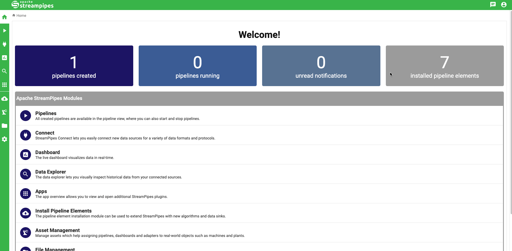

<!--
  ~ Licensed to the Apache Software Foundation (ASF) under one or more
  ~ contributor license agreements.  See the NOTICE file distributed with
  ~ this work for additional information regarding copyright ownership.
  ~ The ASF licenses this file to You under the Apache License, Version 2.0
  ~ (the "License"); you may not use this file except in compliance with
  ~ the License.  You may obtain a copy of the License at
  ~
  ~    http://www.apache.org/licenses/LICENSE-2.0
  ~
  ~ Unless required by applicable law or agreed to in writing, software
  ~ distributed under the License is distributed on an "AS IS" BASIS,
  ~ WITHOUT WARRANTIES OR CONDITIONS OF ANY KIND, either express or implied.
  ~ See the License for the specific language governing permissions and
  ~ limitations under the License.
  ~
-->

# ⚡️ Quickstart

As a quick example, we demonstrate how to set up and configure a StreamPipes client.
In addition, we will get the available data lake measures out of StreamPipes.

```python
from streampipes.client import StreamPipesClient
from streampipes.client.config import StreamPipesClientConfig
from streampipes.client.credential_provider import StreamPipesApiKeyCredentials

config = StreamPipesClientConfig(
    credential_provider = StreamPipesApiKeyCredentials(
        username = "test@streampipes.apache.org",
        api_key = "DEMO-KEY",
        ),
    host_address = "localhost",
    https_disabled = True,
    port = 80
)

client = StreamPipesClient(client_config=config)

# get all available datat lake measures
measures = client.dataLakeMeasureApi.all()

# get amount of retrieved measures
len(measures)
```
Output:
```
1
```
<br>

```
# inspect the data lake measures as pandas dataframe
measures.to_pandas()
```

Output:
```
measure_name timestamp_field ... pipeline_is_running num_event_properties
0 test s0::timestamp ... False 2
[1 rows x 6 columns]
```
<br>
Alternatively, you can provide your credentials via environment variables.
Simply define your credential provider as follows:

```python
from streampipes.client.credential_provider import StreamPipesApiKeyCredentials

StreamPipesApiKeyCredentials()
```
This requires to set the following environment variables: `SP_API_KEY` and `SP_USERNAME`
<br>

`username` is always the username that is used to log in into StreamPipes. <br>
The `api_key` can be generated within the UI as demonstrated below:

