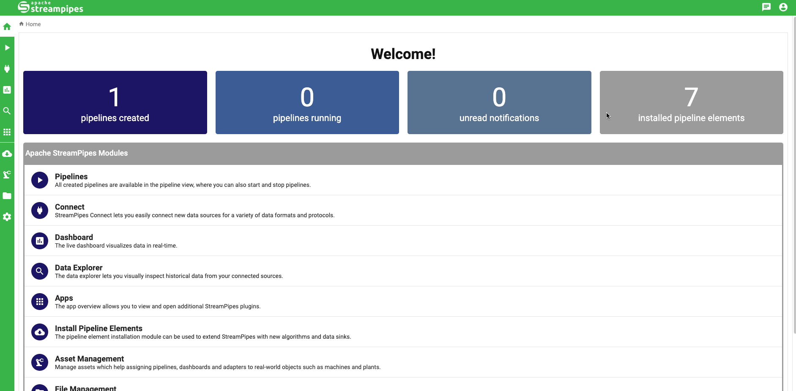

<!--
  ~ Licensed to the Apache Software Foundation (ASF) under one or more
  ~ contributor license agreements.  See the NOTICE file distributed with
  ~ this work for additional information regarding copyright ownership.
  ~ The ASF licenses this file to You under the Apache License, Version 2.0
  ~ (the "License"); you may not use this file except in compliance with
  ~ the License.  You may obtain a copy of the License at
  ~
  ~    http://www.apache.org/licenses/LICENSE-2.0
  ~
  ~ Unless required by applicable law or agreed to in writing, software
  ~ distributed under the License is distributed on an "AS IS" BASIS,
  ~ WITHOUT WARRANTIES OR CONDITIONS OF ANY KIND, either express or implied.
  ~ See the License for the specific language governing permissions and
  ~ limitations under the License.
  ~
-->


<h4 align="center"><a href="https://github.com/apache/streampipes">StreamPipes</a> is a self-service (Industrial) IoT toolbox to enable non-technical users to connect, analyze and explore IoT data streams.</h4>
<br>

!!! danger "Dependency issue with StreamPipes Python 0.92.0"

    In StreamPipes Python `0.92.0` there is a problem with the required dependencies.<br>
    Pydantic has recently released the new version `2.0` with many exciting improvements, but also some breaking changes. 
    Unfortunately, we didn't limit our requirements strictly enough, so yydantic `2.0` is installed together with streampipes, which is not (yet) compatible.<br>
    To fix this bug, simply run the following command after installing streampipes, or adjust your dependencies accordingly:

    ```python
    pip install "pydantic<2.0" "pydantic_core<2.0"
    ```

<br>
<h3 align="center">Apache StreamPipes for Python 🐍</h3>

<p align="center"> Apache StreamPipes meets Python! We are working highly motivated on a Python library to interact with StreamPipes.
In this way, we would like to unite the power of StreamPipes to easily connect to and read from different data sources, especially in the IoT domain,
and the amazing universe of data analytics libraries in Python. </p>

---

<br>

!!! warning "StreamPipes Python is in beta"

    The current version of this Python library is still a beta version.<br>
    This means that it is still heavily under development, which may result in frequent and extensive API changes, unstable behavior, etc.

---

## ⚡️ Quickstart

As a quick example, we demonstrate how to set up and configure a StreamPipes client.
In addition, we will get the available data lake measures out of StreamPipes.

```python
from streampipes.client import StreamPipesClient
from streampipes.client.config import StreamPipesClientConfig
from streampipes.client.credential_provider import StreamPipesApiKeyCredentials

config = StreamPipesClientConfig(
    credential_provider = StreamPipesApiKeyCredentials(
        username = "test@streampipes.apache.org",
        api_key = "DEMO-KEY",
        ),
    host_address = "localhost",
    https_disabled = True,
    port = 80
)

client = StreamPipesClient(client_config=config)

# get all available datat lake measures
measures = client.dataLakeMeasureApi.all()

# get amount of retrieved measures
len(measures)
```
Output:
```
1
```
<br>

```
# inspect the data lake measures as pandas dataframe
measures.to_pandas()
```

Output:
```
measure_name timestamp_field ... pipeline_is_running num_event_properties
0 test s0::timestamp ... False 2
[1 rows x 6 columns]
```
<br>
Alternatively, you can provide your credentials via environment variables.
Simply define your credential provider as follows:

```python
from streampipes.client.credential_provider import StreamPipesApiKeyCredentials

StreamPipesApiKeyCredentials()
```
This requires to set the following environment variables: `SP_API_KEY` and `SP_USERNAME`
<br>

`username` is always the username that is used to log in into StreamPipes. <br>

??? tip "How to get your StreamPipes API key"

    The `api_key` can be generated within the UI as demonstrated below:
    <br>
    
    