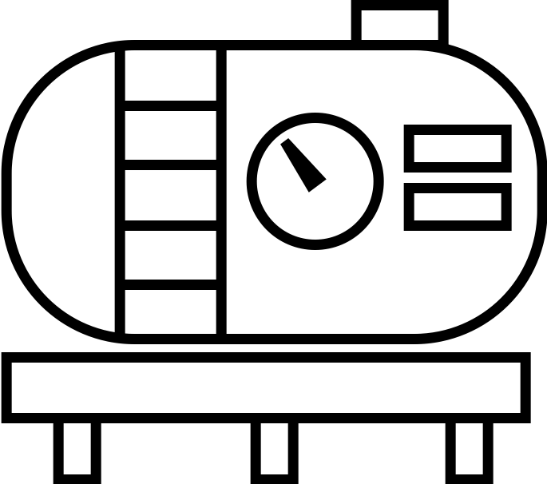

<!--
  ~ Licensed to the Apache Software Foundation (ASF) under one or more
  ~ contributor license agreements.  See the NOTICE file distributed with
  ~ this work for additional information regarding copyright ownership.
  ~ The ASF licenses this file to You under the Apache License, Version 2.0
  ~ (the "License"); you may not use this file except in compliance with
  ~ the License.  You may obtain a copy of the License at
  ~
  ~    http://www.apache.org/licenses/LICENSE-2.0
  ~
  ~ Unless required by applicable law or agreed to in writing, software
  ~ distributed under the License is distributed on an "AS IS" BASIS,
  ~ WITHOUT WARRANTIES OR CONDITIONS OF ANY KIND, either express or implied.
  ~ See the License for the specific language governing permissions and
  ~ limitations under the License.
  ~
  -->

## Machine Data Simulator

 
    

***

## Description

This adapter publishes simulated machine sensor data at a configurable time interval. It is ideal for exploring the
capabilities of StreamPipes without needing your own data or for testing purposes. Three different sensor scenarios are
available:

* Flowrate
* Pressure
* Water Level

All scenarios include an error or anomaly condition, making them suitable for trend detection, anomaly detection, and
similar applications.

### Flowrate Sensor

This scenario simulates a flowrate sensor in a piping system, including a sensor defect situation. The generated data
stream includes:

- **Sensor ID**: The identifier or name of the sensor, such as `sensor01`.
- **Mass Flow**: Numeric value denoting the current mass flow in the sensor, ranging from 0 to 10.
- **Volume Flow**: Numeric value denoting the current volume flow, ranging from 0 to 10.
- **Temperature**: Numeric value denoting the current temperature in degrees Celsius, ranging from 40 to 100.
- **Density**: Numeric value denoting the current density of the fluid, ranging from 40 to 50.
- **Sensor Fault Flags**: Boolean indicator of sensor issues.

The sensor defect scenario is as follows: Normally, temperature values range between 40 and 50 degrees Celsius. After
thirty seconds, the simulation switches to defect mode for another thirty seconds, with temperatures ranging from 80 to
100 degrees Celsius and `Sensor Fault Flags` set to `true`.

### Pressure Sensor

This scenario simulates a pressure sensor in a gas tank, including an anomaly situation. The generated data stream
includes:

- **Sensor ID**: The identifier or name of the sensor, such as `sensor01`.
- **Pressure**: Numeric value denoting the current pressure in the tank, ranging from 10 to 70.

The anomaly scenario is as follows: Normally, pressure values range between 10 and 40. After thirty seconds, the
simulation switches to anomaly mode for another thirty seconds, with pressure values ranging from 40 to 70.

### Water Level Sensor

This scenario simulates a sensor in a water tank, including an overflow situation. The generated data stream includes:

- **Sensor ID**: The identifier or name of the sensor, such as `sensor01`.
- **Level**: Numeric value denoting the current water level in the tank, ranging from 20 to 80.
- **Overflow**: Boolean indicator of tank overflow.

The overflow scenario is as follows: Normally, level values range between 20 and 30. After thirty seconds, the
simulation switches to overflow mode for another thirty seconds, with level values ranging from 60 to 80 and `Overflow`
set to `true`.

## Configuration

When creating the adapter, the following parameters can be configured:

- **Wait Time**: The time in milliseconds between two sensor events. Defaults to 1000 (1 second).
- **Sensor**: Select one of the sensor scenarios described above: `flowrate`, `pressure`, `waterlevel`.

***