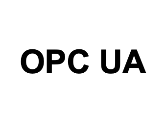

<!--
  ~ Licensed to the Apache Software Foundation (ASF) under one or more
  ~ contributor license agreements.  See the NOTICE file distributed with
  ~ this work for additional information regarding copyright ownership.
  ~ The ASF licenses this file to You under the Apache License, Version 2.0
  ~ (the "License"); you may not use this file except in compliance with
  ~ the License.  You may obtain a copy of the License at
  ~
  ~    http://www.apache.org/licenses/LICENSE-2.0
  ~
  ~ Unless required by applicable law or agreed to in writing, software
  ~ distributed under the License is distributed on an "AS IS" BASIS,
  ~ WITHOUT WARRANTIES OR CONDITIONS OF ANY KIND, either express or implied.
  ~ See the License for the specific language governing permissions and
  ~ limitations under the License.
  ~
  -->

## CouchDB

<p align="center"> 
    
</p>

***

## Description

This data sink can be used to write values to an OPC-UA server.
The sink supports both signed/encrypted and unencrypted communication.

Certificates must be provided directly to the service and cannot be added from the UI or REST APIs.
To establish connections using a `Sign` or `Sign & Encrypt` security mode,
the following environment variables must be provided to the extension service:

* SP_OPCUA_SECURITY_DIR the directory where the keystore and trusted certificates are located
* SP_OPCUA_KEYSTORE_FILE the keystore file (e.g., keystore.pfx, must be of type PKCS12)
* SP_OPCUA_KEYSTORE_PASSWORD the password to the keystore
* SP_OPCUA_APPLICATION_URI the application URI used by the client to identify itself

Certificate requirements:

The X509 certificate must provide the following extras:
* Key Usage: Certificate Sign
* Subject Alternative Name: Application URI
* Basic Constraints: Must provide CA:FALSE when using a self-signed certificate
* Extended Key Usage: TLS Web Server Authentication, TLS Web Client Authentication

The directory layout of the `SP_OPCUA_SECURITY_DIR` look as follows:

```
SP_OPC_SECURITY_DIR/
├─ pki/
│  ├─ issuers/
│  ├─ rejected/
│  ├─ trusted/
│  │  ├─ certs/
│  │  ├─ crl/
```

Trusted certs need to be present in the `pki/trusted/certs` folder.
Rejected certificates are stored in the `rejected` folder.

***

## Required input

This sink does not have any requirements and works with any incoming event type.

***

## Configuration

### Hostname

The hostname of the OPC-UA server.

### Port

The port of the OPC-UA server.

### Security Mode

Can be either None, Signed or Signed & Encrypt

### Security Policy

Choose one of the OPC-UA security policies or `None`

### User Authentication

Choose whether you want to connect anonymously or authenticate using your credentials.

&nbsp;&nbsp;&nbsp;&nbsp; **Anonymous**: No further information required <br/>
&nbsp;&nbsp;&nbsp;&nbsp; **Username/Password**: Insert your `username` and `password` to access the OPC UA server

### Namespace Index

The namespace index in which the node should be written

### Node Id

The node id of the resulting node

### Number Mapping

The property of the event that should be written to the OPC-UA server
