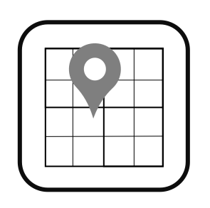

<!--
  ~ Licensed to the Apache Software Foundation (ASF) under one or more
  ~ contributor license agreements.  See the NOTICE file distributed with
  ~ this work for additional information regarding copyright ownership.
  ~ The ASF licenses this file to You under the Apache License, Version 2.0
  ~ (the "License"); you may not use this file except in compliance with
  ~ the License.  You may obtain a copy of the License at
  ~
  ~    http://www.apache.org/licenses/LICENSE-2.0
  ~
  ~ Unless required by applicable law or agreed to in writing, software
  ~ distributed under the License is distributed on an "AS IS" BASIS,
  ~ WITHOUT WARRANTIES OR CONDITIONS OF ANY KIND, either express or implied.
  ~ See the License for the specific language governing permissions and
  ~ limitations under the License.
  ~
  -->

## Spatial Grid Enrichment

 
    

***

## Description

Groups spatial events into cells of a given size.
The result is like a chessboard pattern in which the geo coordinates are inserted. The user can define the coordinates of the first field.

***

## Required input
Requires a latitude and longitude in the data stream.

## Configuration

* Latitude property
* Longitude property
* The size of the cell
* Latitude and longitude of the first cell

## Output
Appends the grid cell coordinates to the input event