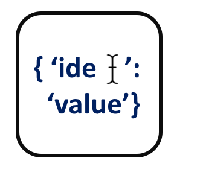

<!--
  ~ Licensed to the Apache Software Foundation (ASF) under one or more
  ~ contributor license agreements.  See the NOTICE file distributed with
  ~ this work for additional information regarding copyright ownership.
  ~ The ASF licenses this file to You under the Apache License, Version 2.0
  ~ (the "License"); you may not use this file except in compliance with
  ~ the License.  You may obtain a copy of the License at
  ~
  ~    http://www.apache.org/licenses/LICENSE-2.0
  ~
  ~ Unless required by applicable law or agreed to in writing, software
  ~ distributed under the License is distributed on an "AS IS" BASIS,
  ~ WITHOUT WARRANTIES OR CONDITIONS OF ANY KIND, either express or implied.
  ~ See the License for the specific language governing permissions and
  ~ limitations under the License.
  ~
  -->

## Field Renamer

<p align="center"> 
    
</p>

***

## Description

Replaces the runtime name of an event property with a custom defined name. Useful for data ingestion purposes where a specific event schema is required.


***

## Required input
There is no specific input required.

***

## Configuration

### Field   
Specifies the field to rename.

### NewFieldName
Specifies the new runtime name of the field.

## Output
Example:

Old Output:
```
{
  'timestamp': 16003000, 
}
```

New Ouput:
```
{
  'time': 16003000, 
}
```