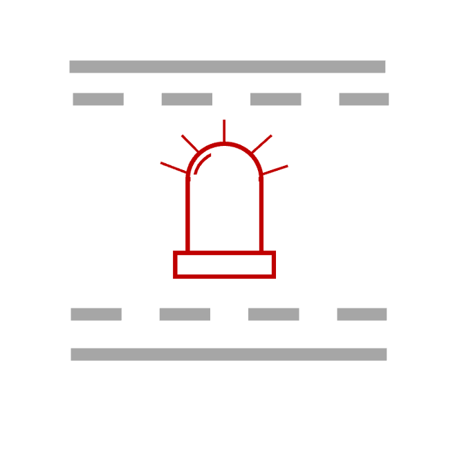

<!--
  ~ Licensed to the Apache Software Foundation (ASF) under one or more
  ~ contributor license agreements.  See the NOTICE file distributed with
  ~ this work for additional information regarding copyright ownership.
  ~ The ASF licenses this file to You under the Apache License, Version 2.0
  ~ (the "License"); you may not use this file except in compliance with
  ~ the License.  You may obtain a copy of the License at
  ~
  ~    http://www.apache.org/licenses/LICENSE-2.0
  ~
  ~ Unless required by applicable law or agreed to in writing, software
  ~ distributed under the License is distributed on an "AS IS" BASIS,
  ~ WITHOUT WARRANTIES OR CONDITIONS OF ANY KIND, either express or implied.
  ~ See the License for the specific language governing permissions and
  ~ limitations under the License.
  ~
  -->

## Sensor Limit Alert

<p align="center"> 
    
</p>

***

## Description

The Sensor Limit Alert processor monitors sensor values in real-time and triggers alerts when these values exceed user-defined control or warning limits. This processor is useful in scenarios where continuous monitoring of critical parameters is required, and immediate action is needed when values go out of acceptable ranges.

***

## Required Input

This processor accepts any event stream containing sensor data. The events must include fields for sensor values and the corresponding upper and lower limits.

***

## Configuration

#### Sensor Value

Select the sensor value to be monitored. This is the primary measurement that will be checked against the defined limits.

#### Upper Control Limit

Specify the upper control limit for the sensor. This value defines the maximum threshold, beyond which an alert is triggered.

#### Upper Warning Limit

Specify the upper warning limit for the sensor. This value indicates when the sensor value is approaching the upper control limit, triggering a warning.

#### Lower Warning Limit

Specify the lower warning limit for the sensor. This value indicates when the sensor value is approaching the lower control limit, triggering a warning.

#### Lower Control Limit

Specify the lower control limit for the sensor. This value defines the minimum threshold, below which an alert is triggered.

***

## Output

The processor emits events only when the sensor value exceeds the specified limits. The output event includes the original sensor data along with additional fields that indicate:
- **Alert Status**: Whether the sensor value breached a WARNING or control LIMIT.
- **Limit Breached**: Which specific limit was breached (e.g., "UPPER_CONTROL_LIMIT" or "LOWER_WARNING_LIMIT").

These output events can be used for triggering notifications or other actions in downstream processing.

***

## Example

### User Configuration
- Mapping fields for:
  - **Sensor Value**
  - **Upper Control Limit**
  - **Upper Warning Limit**
  - **Lower Warning Limit**
  - **Lower Control Limit**

### Input Event
```
{
  "timestamp": 1627891234000,
  "sensorValue": 105.0,
  "upperControlLimit": 100.0,
  "upperWarningLimit": 90.0,
  "lowerWarningLimit": 10.0,
  "lowerControlLimit": 0.0
}
```

### Output Event
```
{
  "timestamp": 1627891234000,
  "sensorValue": 105.0,
  "upperControlLimit": 100.0,
  "upperWarningLimit": 90.0,
  "lowerWarningLimit": 10.0,
  "lowerControlLimit": 0.0,
  "alertStatus": "ALERT",
  "limitBreached": "UPPER_CONTROL_LIMIT"
}
```