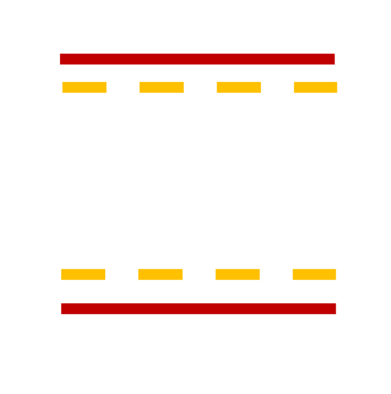

<!--
  ~ Licensed to the Apache Software Foundation (ASF) under one or more
  ~ contributor license agreements.  See the NOTICE file distributed with
  ~ this work for additional information regarding copyright ownership.
  ~ The ASF licenses this file to You under the Apache License, Version 2.0
  ~ (the "License"); you may not use this file except in compliance with
  ~ the License.  You may obtain a copy of the License at
  ~
  ~    http://www.apache.org/licenses/LICENSE-2.0
  ~
  ~ Unless required by applicable law or agreed to in writing, software
  ~ distributed under the License is distributed on an "AS IS" BASIS,
  ~ WITHOUT WARRANTIES OR CONDITIONS OF ANY KIND, either express or implied.
  ~ See the License for the specific language governing permissions and
  ~ limitations under the License.
  ~
  -->

## Quality Control Limits Enrichment

<p align="center"> 
    
</p>

***

## Description

The Quality Control Limits Enrichment processor appends user-defined control and warning limits to incoming events.
These limits can be used in quality control charts to monitor sensor values.

***

## Required Input

This processor works with any event stream. It adds predefined limit values to the events, which are later used for
quality control purposes.

***

## Configuration

#### Upper Control Limit

Specify the upper control limit for the quality control process. This value defines the maximum threshold for acceptable
process behavior.

#### Upper Warning Limit

Specify the upper warning limit for the quality control process. This value indicates when the process is approaching
the upper control limit.

#### Lower Warning Limit

Specify the lower warning limit for the quality control process. This value indicates when the process is approaching
the lower control limit.

#### Lower Control Limit

Specify the lower control limit for the quality control process. This value defines the minimum threshold for acceptable
process behavior.

***

## Output

The processor appends the specified control and warning limits to each input event. These enriched events can be used in
downstream processing to create quality control charts or other monitoring tools.

***

## Example

### User Configuration
- **Upper Control Limit**: `80.0`
- **Upper Warning Limit**: `70.0`
- **Lower Warning Limit**: `30.0`
- **Lower Control Limit**: `20.0`

### Input Event
```
{
  "timestamp": 1627891234000,
  "temperature": 65.0
}
```

### Output Event
```
{
  "timestamp": 1627891234000,
  "temperature": 65.0,
  "upperControlLimit": 80.0,
  "upperWarningLimit": 70.0,
  "lowerWarningLimit": 30.0,
  "lowerControlLimit": 20.0
}
```