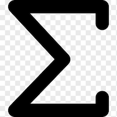

<!--
  ~ Licensed to the Apache Software Foundation (ASF) under one or more
  ~ contributor license agreements.  See the NOTICE file distributed with
  ~ this work for additional information regarding copyright ownership.
  ~ The ASF licenses this file to You under the Apache License, Version 2.0
  ~ (the "License"); you may not use this file except in compliance with
  ~ the License.  You may obtain a copy of the License at
  ~
  ~    http://www.apache.org/licenses/LICENSE-2.0
  ~
  ~ Unless required by applicable law or agreed to in writing, software
  ~ distributed under the License is distributed on an "AS IS" BASIS,
  ~ WITHOUT WARRANTIES OR CONDITIONS OF ANY KIND, either express or implied.
  ~ See the License for the specific language governing permissions and
  ~ limitations under the License.
  ~
  -->

## Sigma

    

***

## Description

This processor performs sigma operation on the selected number field i.e. addition of a sequence of numbers.

***

## Required input

A number field is required in the data stream and can be selected with the field mapping.

### Number Field

The number field to be summed.

***

## Configuration

(no further configuration required)

## Output

* [sigmaResult] Sum of the last value and new value

The event is emitted whenever new value comes in stream.