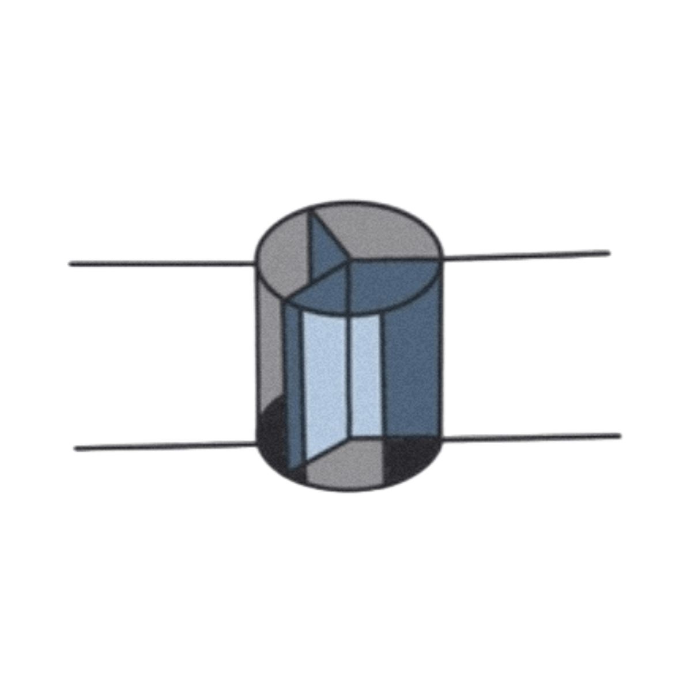

<!--
  ~ Licensed to the Apache Software Foundation (ASF) under one or more
  ~ contributor license agreements.  See the NOTICE file distributed with
  ~ this work for additional information regarding copyright ownership.
  ~ The ASF licenses this file to You under the Apache License, Version 2.0
  ~ (the "License"); you may not use this file except in compliance with
  ~ the License.  You may obtain a copy of the License at
  ~
  ~    http://www.apache.org/licenses/LICENSE-2.0
  ~
  ~ Unless required by applicable law or agreed to in writing, software
  ~ distributed under the License is distributed on an "AS IS" BASIS,
  ~ WITHOUT WARRANTIES OR CONDITIONS OF ANY KIND, either express or implied.
  ~ See the License for the specific language governing permissions and
  ~ limitations under the License.
  ~
  -->

## Swinging Door Trending (SDT) Filter Processor

 
    

***

## Description

The **Swinging Door Trending (SDT)** algorithm is a linear trend compression algorithm. 
In essence, it replaces a series of continuous `(timestamp, value)` points with a straight line determined by the start and end points.

The **Swinging Door Trending (SDT) Filter Processor** can extract and forward the characteristic events of the original stream.
In general, this filter can also be used to reduce the frequency of original data in a lossy way.

***

## Required Inputs

The processor works with any input event that has **one field containing a timestamp** and 
**one field containing a numerical value**.

***

## Configuration

### Timestamp Field
Specifies the timestamp field name where the SDT algorithm should be applied on.

### Value Field
Specifies the value field name where the SDT algorithm should be applied on.

### Compression Deviation
**Compression Deviation** is the most important parameter in SDT that represents the maximum difference 
between the current sample and the current linear trend. 

**Compression Deviation** needs to be greater than 0 to perform compression.

### Compression Minimum Time Interval
**Compression Minimum Time Interval** is a parameter measures the time distance between two stored data points, 
which is used for noisy reduction. 

If the time interval between the current point and the last stored point is less than or equal to its value, 
current point will NOT be stored regardless of compression deviation. 

The default value is `0` with time unit ms.

### Compression Maximum Time Interval
**Compression Maximum Time Interval** is a parameter measure the time distance between two stored data points. 

If the time interval between the current point and the last stored point is greater than or equal to its value, 
current point will be stored regardless of compression deviation. 

The default value is `9,223,372,036,854,775,807`(`Long.MAX_VALUE`) with time unit ms.

***

## Output
The characteristic event stream forwarded by the SDT filter.
