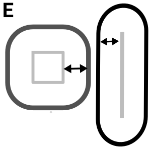

<!--
  ~ Licensed to the Apache Software Foundation (ASF) under one or more
  ~ contributor license agreements.  See the NOTICE file distributed with
  ~ this work for additional information regarding copyright ownership.
  ~ The ASF licenses this file to You under the Apache License, Version 2.0
  ~ (the "License"); you may not use this file except in compliance with
  ~ the License.  You may obtain a copy of the License at
  ~
  ~    http://www.apache.org/licenses/LICENSE-2.0
  ~
  ~ Unless required by applicable law or agreed to in writing, software
  ~ distributed under the License is distributed on an "AS IS" BASIS,
  ~ WITHOUT WARRANTIES OR CONDITIONS OF ANY KIND, either express or implied.
  ~ See the License for the specific language governing permissions and
  ~ limitations under the License.
  ~
  -->

## Buffer Geometry

    

***

## Description

Creates a buffer polygon geometry from a geometry
***

## Required inputs

* JTS Geometry
* EPSG Code
* Distance
* Cap Style
* Join Style
* Mitre-Limit
* Side
* Simplify Factor
* Quadrant Segments
***

## Configuration

### Geometry field
Input Geometry

### EPSG field
Integer value representing EPSG code

### Distance
The buffer distance around in geometry in meter

### Cap Style
Defines the endcap style of the buffer.
* CAP_ROUND - the usual round end caps
* CAP_FLAT - end caps are truncated flat at the line ends
* CAP_SQUARE - end caps are squared off at the buffer distance beyond the line ends 

### Simplify Factor
The default simplify factor Provides an accuracy of about 1%, which matches the accuracy of the 
default Quadrant Segments parameter.

### Quadrant Segments
The default number of facets into which to divide a fillet of 90 degrees.

### Join Style
Defines the corners in a buffer
* JOIN_ROUND - the usual round join
* JOIN_MITRE - corners are "sharp" (up to a distance limit)
* JOIN_BEVEL - corners are beveled (clipped off). 

### Mitre-Limit
Mitre ratio limit (only affects mitered join style)

### Side
`left` or `right` performs a single-sided buffer on the geometry, with the buffered side 
relative to the direction of the line or polygon.

***

## Output
A polygon geometry with EPSG code. Shape is defined by input parameters.

### Example

