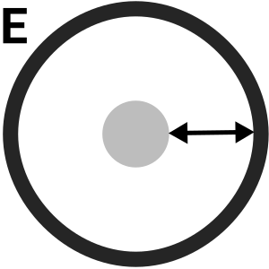

<!--
  ~ Licensed to the Apache Software Foundation (ASF) under one or more
  ~ contributor license agreements.  See the NOTICE file distributed with
  ~ this work for additional information regarding copyright ownership.
  ~ The ASF licenses this file to You under the Apache License, Version 2.0
  ~ (the "License"); you may not use this file except in compliance with
  ~ the License.  You may obtain a copy of the License at
  ~
  ~    http://www.apache.org/licenses/LICENSE-2.0
  ~
  ~ Unless required by applicable law or agreed to in writing, software
  ~ distributed under the License is distributed on an "AS IS" BASIS,
  ~ WITHOUT WARRANTIES OR CONDITIONS OF ANY KIND, either express or implied.
  ~ See the License for the specific language governing permissions and
  ~ limitations under the License.
  ~
  -->

## Buffer Point Geometry

    

***

## Description

Creates a buffer polygon geometry from a point geometry
***

## Required inputs

* WKT of a JTS Point Geometry
* Integer value representing EPSG code
* Distance
* Cap Style
* Simplify Factor
* Quadrant Segments
***

## Configuration

### 1st parameter
Input Point Geometry

### 2nd parameter
EPSG code value

### 3rd parameter
Distance
The buffer distance around in geometry in meter

### 4rd parameter
Cap Style
CAP_ROUND - the usual round end caps
CAP_SQUARE - end caps are squared off at the buffer distance beyond the line ends

### 5rd parameter
Simplify Factor
The default simplify factor Provides an accuracy of about 1%, which matches the accuracy of the
default Quadrant Segments parameter.

### 6rd parameter
Quadrant Segments
The default number of facets into which to divide a fillet of 90 degrees.

***

## Output

    

### Example

