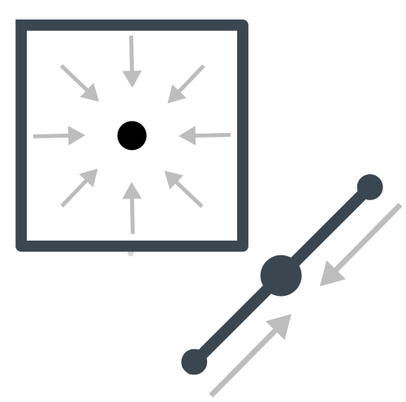

<!--
  ~ Licensed to the Apache Software Foundation (ASF) under one or more
  ~ contributor license agreements.  See the NOTICE file distributed with
  ~ this work for additional information regarding copyright ownership.
  ~ The ASF licenses this file to You under the Apache License, Version 2.0
  ~ (the "License"); you may not use this file except in compliance with
  ~ the License.  You may obtain a copy of the License at
  ~
  ~    http://www.apache.org/licenses/LICENSE-2.0
  ~
  ~ Unless required by applicable law or agreed to in writing, software
  ~ distributed under the License is distributed on an "AS IS" BASIS,
  ~ WITHOUT WARRANTIES OR CONDITIONS OF ANY KIND, either express or implied.
  ~ See the License for the specific language governing permissions and
  ~ limitations under the License.
  ~
  -->

## Interior Point

    

***

## Description
Creates a Point of every other Geometry (not included a Point itself).

***

## Required inputs

* JTS Geometry
* EPSG Code
* Point Output Type
***

## Configuration

### Geometry field
Input Geometry

### EPSG field
Integer value representing EPSG code

### Point Output Type
Chose between 
* Interior Point
  *  An interior point is guaranteed to lie in the interior of the Geometry, 
  if it is possible to calculate such a point exactly. Otherwise, the point may lie on 
  the boundary of the geometry.
* Centroid Point
  * Computes the centroid of a Geometry 

***

## Output
A point geometry with EPSG code.

### Example

