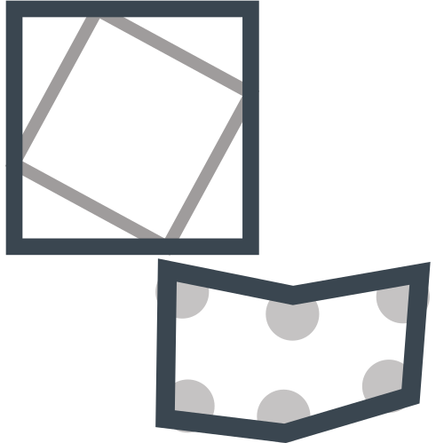

<!--
  ~ Licensed to the Apache Software Foundation (ASF) under one or more
  ~ contributor license agreements.  See the NOTICE file distributed with
  ~ this work for additional information regarding copyright ownership.
  ~ The ASF licenses this file to You under the Apache License, Version 2.0
  ~ (the "License"); you may not use this file except in compliance with
  ~ the License.  You may obtain a copy of the License at
  ~
  ~    http://www.apache.org/licenses/LICENSE-2.0
  ~
  ~ Unless required by applicable law or agreed to in writing, software
  ~ distributed under the License is distributed on an "AS IS" BASIS,
  ~ WITHOUT WARRANTIES OR CONDITIONS OF ANY KIND, either express or implied.
  ~ See the License for the specific language governing permissions and
  ~ limitations under the License.
  ~
  -->

## Interior Point

    

***

## Description
A single polygon geometry is derived from any geometry (except a
point itself)

***

## Required inputs

* JTS Geometry
* EPSG Code
* Polygon Output Type
***

## Configuration

### Geometry field
Input Geometry

### EPSG field
Integer value representing EPSG code

### Point Output Type
Chose between 
* **Bounding Box:**  Gets a Geometry representing the bounding box of this geometry, whose vertices are 
(minx miny, minx maxy, maxx maxy, maxx miny, minx miny).
* **Convex Hull**: Computes the smallest convex Polygon that contains all the points in the Geometry.

***

## Output
A polygon geometry with EPSG code.

### Example

    

