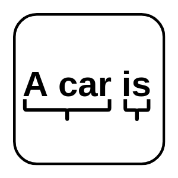

<!--
  ~ Licensed to the Apache Software Foundation (ASF) under one or more
  ~ contributor license agreements.  See the NOTICE file distributed with
  ~ this work for additional information regarding copyright ownership.
  ~ The ASF licenses this file to You under the Apache License, Version 2.0
  ~ (the "License"); you may not use this file except in compliance with
  ~ the License.  You may obtain a copy of the License at
  ~
  ~    http://www.apache.org/licenses/LICENSE-2.0
  ~
  ~ Unless required by applicable law or agreed to in writing, software
  ~ distributed under the License is distributed on an "AS IS" BASIS,
  ~ WITHOUT WARRANTIES OR CONDITIONS OF ANY KIND, either express or implied.
  ~ See the License for the specific language governing permissions and
  ~ limitations under the License.
  ~
  -->

## Chunker

<p align="center"> 
    
</p>

***

## Description

Segments given tokens into chunks (e.g. noun groups, verb groups, ...) and appends the found chunks to the stream.

***

## Required input

Needs a stream with two string list properties:
1. A list of tokens 
2. A list of part-of-speech tags (the Part-of-Speech processing element can be used for that)

***

## Configuration

Assign the tokens and the part of speech tags to the corresponding stream property.
To use this component you have to download or train an openNLP model:
https://opennlp.apache.org/models.html

## Output

**Example:**

Input:
```
tokens: ["John", "is", "a", "Person"]
tags: ["NNP", "VBZ", "DT", "NN"]
```

Output:
```
tokens: ["John", "is", "a", "Person"]
tags: ["NNP", "VBZ", "DT", "NN"]
chunks: ["John", "is", "a Person"]
chunkType: ["NP", "VP", "NP"])
```
