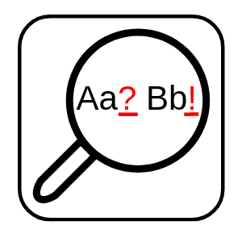

<!--
  ~ Licensed to the Apache Software Foundation (ASF) under one or more
  ~ contributor license agreements.  See the NOTICE file distributed with
  ~ this work for additional information regarding copyright ownership.
  ~ The ASF licenses this file to You under the Apache License, Version 2.0
  ~ (the "License"); you may not use this file except in compliance with
  ~ the License.  You may obtain a copy of the License at
  ~
  ~    http://www.apache.org/licenses/LICENSE-2.0
  ~
  ~ Unless required by applicable law or agreed to in writing, software
  ~ distributed under the License is distributed on an "AS IS" BASIS,
  ~ WITHOUT WARRANTIES OR CONDITIONS OF ANY KIND, either express or implied.
  ~ See the License for the specific language governing permissions and
  ~ limitations under the License.
  ~
  -->

## Sentence Detection

 
    

***

## Description

Detects sentences in a text and splits the text accordingly. Only works with english sentences.

***

## Required input

A stream with a string property which contains a text.

***

## Configuration

Simply assign the correct output of the previous stream to the tokenizer input.
To use this component you have to download or train an openNLP model:
https://opennlp.apache.org/models.html

## Output

Creates for each sentence in a text a new event in which it replaces the text with the sentence.

**Example:**

Input: `(text: "Hi, how are you? I am fine!")`

Output: `(text: "Hi, how are you?")`, `(text: "I am fine!")`
