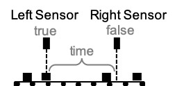

<!--
  ~ Licensed to the Apache Software Foundation (ASF) under one or more
  ~ contributor license agreements.  See the NOTICE file distributed with
  ~ this work for additional information regarding copyright ownership.
  ~ The ASF licenses this file to You under the Apache License, Version 2.0
  ~ (the "License"); you may not use this file except in compliance with
  ~ the License.  You may obtain a copy of the License at
  ~
  ~    http://www.apache.org/licenses/LICENSE-2.0
  ~
  ~ Unless required by applicable law or agreed to in writing, software
  ~ distributed under the License is distributed on an "AS IS" BASIS,
  ~ WITHOUT WARRANTIES OR CONDITIONS OF ANY KIND, either express or implied.
  ~ See the License for the specific language governing permissions and
  ~ limitations under the License.
  ~
  -->

## Measure Time Between Two Sensors

    

***

## Description

This processor can be used to measure the time between two boolean sensors.
For example on a conveyor, where one sensor is placed on the left and one senor placed on the right.
Parts are transported on the conveyor and the sensors are boolean sensors detecting those parts.
The time is measured between the two sensors as well as the amount of complete transportation's is counted.
The measurement is initialized once the left sensor is true and stopped once the right sensor is true.
There can also be multiple parts on the conveyor as long as the individual parts do not change.

    

***

## Required input
Requires two boolean fields in the datastream.

### Left Field
The left field starts the timer when value is true.

### Right Field
The right field stops the timer and emits the event when its value is true.

***

## Configuration
No furhter configuration is required.

## Output
Appends two fields to the input event.

### Timer Field
The timer field is a numeric value representing the time between the two sensors. Runtime name: measured_time

### Counter
The counter indicated how many events where emitted by this component. Runtime name: counter