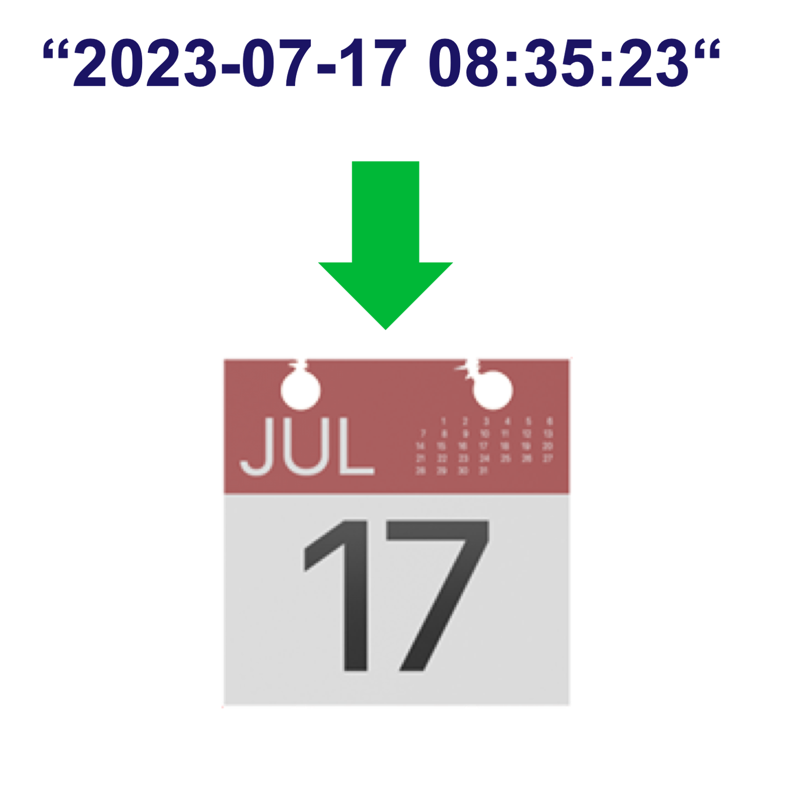

<!--
  ~ Licensed to the Apache Software Foundation (ASF) under one or more
  ~ contributor license agreements.  See the NOTICE file distributed with
  ~ this work for additional information regarding copyright ownership.
  ~ The ASF licenses this file to You under the Apache License, Version 2.0
  ~ (the "License"); you may not use this file except in compliance with
  ~ the License.  You may obtain a copy of the License at
  ~
  ~    http://www.apache.org/licenses/LICENSE-2.0
  ~
  ~ Unless required by applicable law or agreed to in writing, software
  ~ distributed under the License is distributed on an "AS IS" BASIS,
  ~ WITHOUT WARRANTIES OR CONDITIONS OF ANY KIND, either express or implied.
  ~ See the License for the specific language governing permissions and
  ~ limitations under the License.
  ~
  -->

## DateTime Parser

    

***

## Description

This processor parses a datetime string and puts it in a ZonedDateTime object.

***

## Required input

A string field that has an ISO DateTime format is required in the data stream.
A String field from a selection of possible time zones. 

***

## Configuration
A user can configure what TimeZone the datetime string applies to. This configuration will 
only apply if the DateTime string does not already have the time zone information. 

## Output
The event is emitted each time a packet with a datetime is received. 
The following field is appended to the event:

* [ZonedDateTime] the parsed object from the input string
Runtime Name: dateTime
