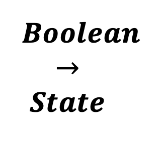

<!--
  ~ Licensed to the Apache Software Foundation (ASF) under one or more
  ~ contributor license agreements.  See the NOTICE file distributed with
  ~ this work for additional information regarding copyright ownership.
  ~ The ASF licenses this file to You under the Apache License, Version 2.0
  ~ (the "License"); you may not use this file except in compliance with
  ~ the License.  You may obtain a copy of the License at
  ~
  ~    http://www.apache.org/licenses/LICENSE-2.0
  ~
  ~ Unless required by applicable law or agreed to in writing, software
  ~ distributed under the License is distributed on an "AS IS" BASIS,
  ~ WITHOUT WARRANTIES OR CONDITIONS OF ANY KIND, either express or implied.
  ~ See the License for the specific language governing permissions and
  ~ limitations under the License.
  ~
  -->

## Boolean To State

    

***

## Description

Converts boolean fields to a state string representing the current state of the system.
This processor requires one or multiple boolean values in the data stream.
For the selected value which is true, the runtime name is added as the state field.
***

## Required input

### Boolean Fields

Boolean fields that are converted to the state when true

### Default State

When all boolean values are false, a default state can be defined

### Mapping Configuration

Configuration to provide a string mapping for each possible value.
On the left ist the value of the runtime name and on the right the new value (e.g. {"runtimeName": "newValue"}).

***

## Configuration

No further configuration required

## Output

The output contains a new value with the string values of the state
