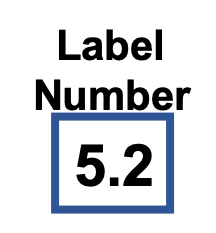

<!--
  ~ Licensed to the Apache Software Foundation (ASF) under one or more
  ~ contributor license agreements.  See the NOTICE file distributed with
  ~ this work for additional information regarding copyright ownership.
  ~ The ASF licenses this file to You under the Apache License, Version 2.0
  ~ (the "License"); you may not use this file except in compliance with
  ~ the License.  You may obtain a copy of the License at
  ~
  ~    http://www.apache.org/licenses/LICENSE-2.0
  ~
  ~ Unless required by applicable law or agreed to in writing, software
  ~ distributed under the License is distributed on an "AS IS" BASIS,
  ~ WITHOUT WARRANTIES OR CONDITIONS OF ANY KIND, either express or implied.
  ~ See the License for the specific language governing permissions and
  ~ limitations under the License.
  ~
  -->

## Number Labeler

    

***

## Description

Apply a rule to a value of a field. (E.g. when minimum value is lower then 10, add label `not ok` else add label `ok`)

***

## Required input

Requires a sensor value

### Sensor value

A number representing the current sensor value.

***

## Configuration

### Condition
Define a rule which label to add. Example: `<;5;nok` means when the calculated value is smaller then 5 add label ok.
The default label can be defined with `*;nok`.
The first rule that is true defines the label. Rules are applied in the same order as defined here.

## Output
Appends a new field  with the label defined in the Condition Configuration
