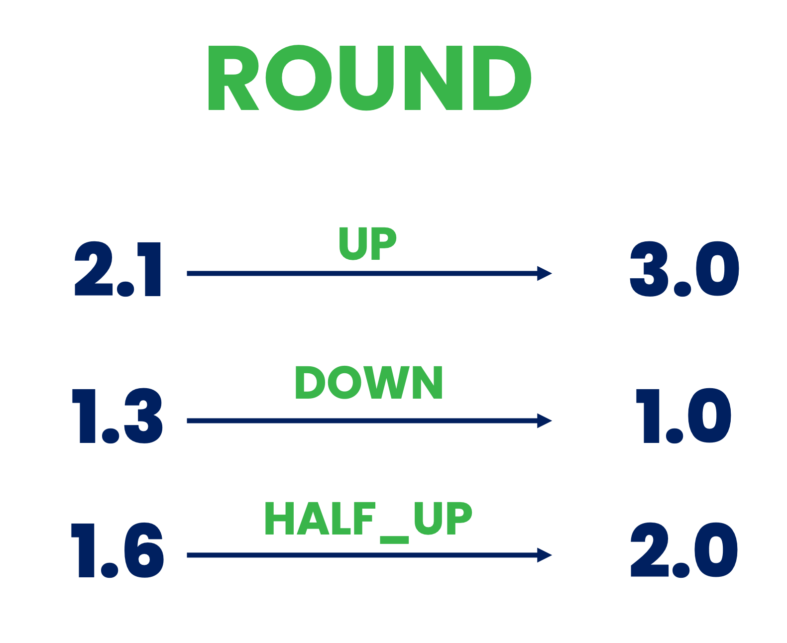

<!--
  ~ Licensed to the Apache Software Foundation (ASF) under one or more
  ~ contributor license agreements.  See the NOTICE file distributed with
  ~ this work for additional information regarding copyright ownership.
  ~ The ASF licenses this file to You under the Apache License, Version 2.0
  ~ (the "License"); you may not use this file except in compliance with
  ~ the License.  You may obtain a copy of the License at
  ~
  ~    http://www.apache.org/licenses/LICENSE-2.0
  ~
  ~ Unless required by applicable law or agreed to in writing, software
  ~ distributed under the License is distributed on an "AS IS" BASIS,
  ~ WITHOUT WARRANTIES OR CONDITIONS OF ANY KIND, either express or implied.
  ~ See the License for the specific language governing permissions and
  ~ limitations under the License.
  ~
  -->

## Number Rounder

    

***

## Description

This processor rounds numeric values to the given decimal places.
It supports multiple rounding strategies.

***

## Required input

This processor requires an event that provides numerical properties.

***

## Configuration

### Fields to Be Rounded

Select which fields of the event should be rounded.

### Number of Digits

Specify the number of digits after the decimal point to round/keep, e.g., if number is 2.8935 and 'digits' is 3,
the result will be 2.894.

### Mode of Rounding

Specify the mode of rounding. 
Supported rounding modes:
* `UP`: Rounding mode to round away from zero. Always increments the digit prior to a non-zero discarded fraction. Note that this rounding mode never decreases the magnitude of the calculated value.
* `DOWN`: Rounding mode to round towards zero. Never increments the digit prior to a discarded fraction (i.e., truncates). Note that this rounding mode never increases the magnitude of the calculated value.
* `CEILING`: Rounding mode to round towards positive infinity. If the result is positive, behaves as for `UP`; if negative, behaves as for `DOWN`. Note that this rounding mode never decreases the calculated value
* `FLOOR`: Rounding mode to round towards negative infinity. If the result is positive, behave as for `DOWN`; if negative, behave as for `UP`. Note that this rounding mode never increases the calculated value.
* `HALF_UP`: Rounding mode to round towards "nearest neighbor" unless both neighbors are equidistant, in which case round up. Behaves as for `UP` if the discarded fraction is ≥ 0.5; otherwise, behaves as for `DOWN`.
* `HALF_DOWN`: Rounding mode to round towards "nearest neighbor" unless both neighbors are equidistant, in which case round down. Behaves as for `UP` if the discarded fraction is > 0.5; otherwise, behaves as for `DOWN`.
* `HALF_EVEN`: Rounding mode to round towards the "nearest neighbor" unless both neighbors are equidistant, in which case, round towards the even neighbor. Behaves as for `HALF_UP` if the digit to the left of the discarded fraction is odd; behaves as for `HALF_DOWN` if it's even. Note that this is the rounding mode that statistically minimizes cumulative error when applied repeatedly over a sequence of calculations.

## Output

The output of this processor is the same event with the fields selected by the ``Fiels to Be Rounded`` parameter rounded
to ``Number of Digits`` digits.