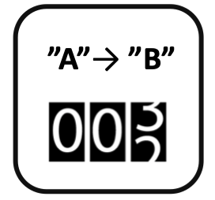

<!--
  ~ Licensed to the Apache Software Foundation (ASF) under one or more
  ~ contributor license agreements.  See the NOTICE file distributed with
  ~ this work for additional information regarding copyright ownership.
  ~ The ASF licenses this file to You under the Apache License, Version 2.0
  ~ (the "License"); you may not use this file except in compliance with
  ~ the License.  You may obtain a copy of the License at
  ~
  ~    http://www.apache.org/licenses/LICENSE-2.0
  ~
  ~ Unless required by applicable law or agreed to in writing, software
  ~ distributed under the License is distributed on an "AS IS" BASIS,
  ~ WITHOUT WARRANTIES OR CONDITIONS OF ANY KIND, either express or implied.
  ~ See the License for the specific language governing permissions and
  ~ limitations under the License.
  ~
  -->

## String Counter

    

***

## Description

This processor monitors a string field and counts how often the value of the string changes.
Hereby, a change is characterized by
the value of the field before and the value after the change, combined forming a pair.
The processor keeps track of the counter for each pair.

***

## Required input

A string field is required in the data stream and can be selected with the field mapping.

### String Field

The string field to be monitored.

***

## Configuration

(no further configuration required)

## Output

The following three fields are appended to the event:

* [counter] numerical field with the current count value for the given value pair
* [change_from] the value of the string before the change
* [change_to] the value of the string after the change

The event is emitted whenever the value of the string field changes.

