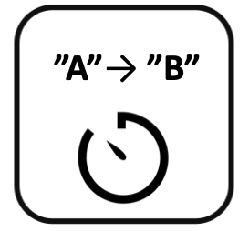

<!--
  ~ Licensed to the Apache Software Foundation (ASF) under one or more
  ~ contributor license agreements.  See the NOTICE file distributed with
  ~ this work for additional information regarding copyright ownership.
  ~ The ASF licenses this file to You under the Apache License, Version 2.0
  ~ (the "License"); you may not use this file except in compliance with
  ~ the License.  You may obtain a copy of the License at
  ~
  ~    http://www.apache.org/licenses/LICENSE-2.0
  ~
  ~ Unless required by applicable law or agreed to in writing, software
  ~ distributed under the License is distributed on an "AS IS" BASIS,
  ~ WITHOUT WARRANTIES OR CONDITIONS OF ANY KIND, either express or implied.
  ~ See the License for the specific language governing permissions and
  ~ limitations under the License.
  ~
  -->

## String Timer

 
    

***

## Description

This processor measures how long a value of a string field does not change. Once the value is changes the event with the measured time and the corresponding string value is emitted.

***

## Required input

A string field is required in the data stream.

### Field

The string field which is monitored for any value changes.

***

## Configuration

### Output Frequency 

Define when an event should be emitted, either on each input event or just when the string value changes.

## Output
The following two fields are appended to the event:
* [measured_time] the measured time for the string value to not change
* [field_value] the corresponding string value 

The event is emitted whenever the value of the string field changes.

