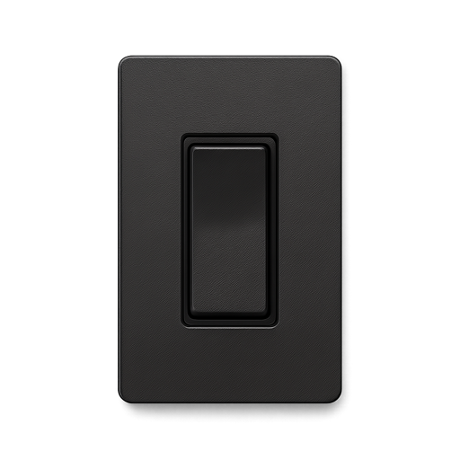

<!--
  ~ Licensed to the Apache Software Foundation (ASF) under one or more
  ~ contributor license agreements.  See the NOTICE file distributed with
  ~ this work for additional information regarding copyright ownership.
  ~ The ASF licenses this file to You under the Apache License, Version 2.0
  ~ (the "License"); you may not use this file except in compliance with
  ~ the License.  You may obtain a copy of the License at
  ~
  ~    http://www.apache.org/licenses/LICENSE-2.0
  ~
  ~ Unless required by applicable law or agreed to in writing, software
  ~ distributed under the License is distributed on an "AS IS" BASIS,
  ~ WITHOUT WARRANTIES OR CONDITIONS OF ANY KIND, either express or implied.
  ~ See the License for the specific language governing permissions and
  ~ limitations under the License.
  ~
  -->

# Switch Operator Processor

<p align="center"> 
    
</p>

## Example


This example demonstrates using the Switch Operator to evaluate a device status field:

1. Select "deviceStatus" as the input field to monitor
2. Configure a switch case to match "ONLINE" status and return TRUE
3. Configure a default output of FALSE for all other values
4. The processor returns TRUE when the device is online, and FALSE otherwise

For example, when the input event is:
```json
{
  "deviceId": "pump-1",
  "deviceStatus": "ONLINE",
  "timestamp": 1716930475000
}
```

The output will include the original event plus:
```json
{
  "switch-filter-result": true
}
```

***

## Description

The Switch Operator processor evaluates the value of a selected input field against a set of predefined cases, and produces a boolean output based on the matching case. It works like a switch-case statement in programming languages.

This processor is useful for:
* Converting string status values to boolean signals
* Implementing conditional logic in your data pipeline
* Triggering different pipeline branches based on specific field values
* Creating boolean flags for downstream processors or dashboards

The processor always forwards all events, adding a result field that contains the boolean outcome of the evaluation.

***

## Configuration

The Switch Operator requires the following configuration:

1. **Input Field** - Select the field from the input event that you want to evaluate in the switch statement
2. **Switch Cases** - Define one or more case values to match against:
    * **Case Value** - The exact string value to match against the input field
    * **Output Value** - The boolean result (true/false) to return when this case matches
3. **Default Output Value** - The boolean value to return when no cases match (default: false)

Note: If the input field is missing or contains a null value, the default output value will be used.

## Output

The processor forwards all incoming events and adds a new field:

* **switch-filter-result** - A boolean field (true/false) based on the case matching result

For example, if you have an event with a "status" field containing "ACTIVE" and your switch case is configured to return true for "ACTIVE", the output will contain the original event plus the `switch-filter-result: true` field.
