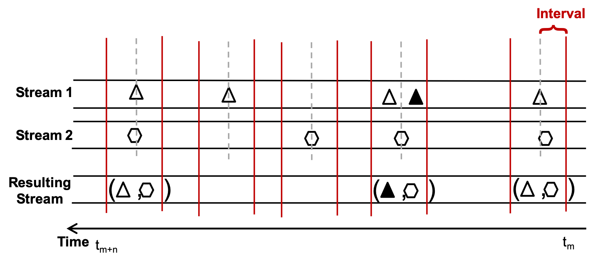

<!--
  ~ Licensed to the Apache Software Foundation (ASF) under one or more
  ~ contributor license agreements.  See the NOTICE file distributed with
  ~ this work for additional information regarding copyright ownership.
  ~ The ASF licenses this file to You under the Apache License, Version 2.0
  ~ (the "License"); you may not use this file except in compliance with
  ~ the License.  You may obtain a copy of the License at
  ~
  ~    http://www.apache.org/licenses/LICENSE-2.0
  ~
  ~ Unless required by applicable law or agreed to in writing, software
  ~ distributed under the License is distributed on an "AS IS" BASIS,
  ~ WITHOUT WARRANTIES OR CONDITIONS OF ANY KIND, either express or implied.
  ~ See the License for the specific language governing permissions and
  ~ limitations under the License.
  ~
  -->

## Merge By Timestamp 

 
    

***

## Description

Merges two event streams by their timestamp.
Two events of the different streams are merged when they occure to the same time

The following figure shows how the events of the two data streams will be mergrged:

 
    

***

## Required input
Each of the data streams needs a timestamp.

***

## Configuration

* For each stream a the timestamp property on which the merger is performed has to be selected
* The Time Interval describes the maximum value between two events to decide whether they are a match. To be a valid match the following function must be true: | timestamp_stream_1 - timestamp_stream_2 | < interval

## Output
The Compose processor has a configurable output that can be selected by the user at pipeline modeling time.