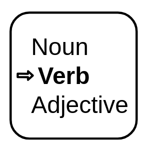

## Part of Speech Tagger

 
    

***

## Description

Takes in a stream of tokens and appends a tag at the end of the word corresponding to the part of speech
The list of used suffixes can be found [here](https://www.ling.upenn.edu/courses/Fall_2003/ling001/penn_treebank_pos.html)

Add a detailed description here

***

## Required input

***

## Configuration

Describe the configuration parameters here

### 1st parameter

### 2nd parameter

## Output