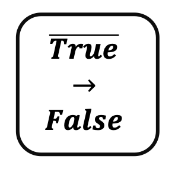

## Value Changed

 
    

***

## Description

This processor requires a boolean value in the data stream and inverts its value. (e.g. true -> flase)

***

## Required input

### Boolean Field

The boolean value to be inverted.

***

## Configuration
No further configuration required

## Output
The output schema is the same as the input schema. Just the value of the property is changed.